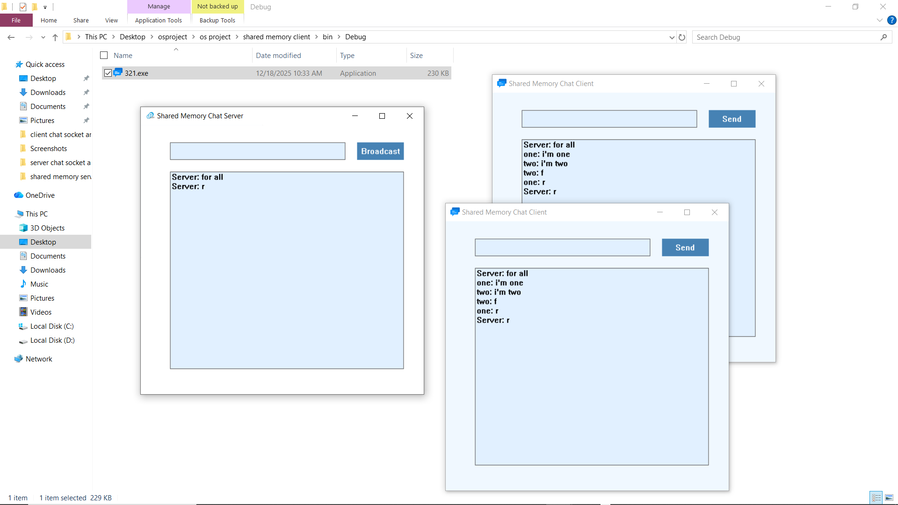

# Chat System Project

## Project Overview
This project implements two chat systems with simple graphical user interfaces (GUI) using **C++**. The project demonstrates two types of inter-process communication:

1. **Sockets and Multithreading**  
   - Allows users to communicate over a network on different machines.  
   - Uses TCP sockets and multithreading to support multiple clients simultaneously.

2. **Shared Memory and Synchronization**  
   - Allows users to communicate on the same machine.  
   - Uses shared memory with synchronization primitives (mutexes/events) to ensure data integrity.

---

## Project Structure

<pre>
  OS_Project/
  │
  ├── SocketClient/ # Socket-based Chat Client project
  │ ├── client.cbp # Code::Blocks project file
  │ └── bin/
  │ └── debug/
  │ └── gui.exe # Runs as admin
  │
  ├── SocketServer/ # Socket-based Chat Server project
  │ ├── server.cbp # Code::Blocks project file
  │ └── bin/
  │ └── debug/
  │ └── gui2.exe # Runs as admin
  │
  ├── SharedMemoryClient/ # Shared-Memory Chat Client project
  │ ├── client2.cbp # Code::Blocks project file
  │ └── bin/
  │ └── debug/
  │ └── gui3.exe # Runs as admin
  │
  ├── SharedMemoryServer/ # Shared-Memory Chat Server project
  │ ├── server2.cbp # Code::Blocks project file
  │ └── bin/
  │ └── debug/
  │ └── gui4.exe # Runs as admin
  │
  └── README.md # Project documentation, screenshots, demo
</pre>
## Team Members & Contributions

| Team Member | ID | Contribution |
|------------|----|-------------|
| Malak Magdy Mohammed Abdalwahab | 2300512 | Implemented Socket-based chat client GUI |
| Mohamed Ahmed Abdel Fatah Hussein Ismail | 2300535 | Implemented Socket-based chat server GUI |
| Mohamed Ibrahim Abdelfattah Youssef Shalaby | 2300528 | Implemented Shared-Memory chat server |
| Sama Omar Saad Mohamed Meliha | 2300522 | Implemented Shared-Memory chat client GUI |
| Ahmed Mohamed Morsy Abdallah | 2302383 | Implemented Shared-Memory chat client GUI and project documentation |

---

## How to Open and Use the Project

1. Run the **server first** (either TCP Socket or Shared Memory version).  
2. Run any number of **clients** of the same type.  
3. Make sure to **run all .exe files as Administrator** on Windows.  
4. Both servers and clients have a GUI to:
   - Enter IP/Port (for TCP Socket communication)  
   - Use default shared memory (for Shared Memory communication)  
5. Messages sent from clients will appear in all connected clients’ log boxes in real time.

---

## Required Installations

- **Operating System:** Windows (server and clients tested on Windows)  
- **Compiler:** Code::Blocks or any C/C++ compiler supporting Win32 API and Winsock2  
- **Run Instructions:** Run all `.exe` files as Administrator  
- **Libraries:** No additional libraries required (uses standard Windows API)

---

## Screenshots & Demo

### Socket Chat System

### Shared Memory Chat System

---

## Notes
- This project demonstrates practical usage of **TCP sockets, multithreading, shared memory, and synchronization primitives** in C++.  
- It is intended as a learning resource for OS and networking concepts, as well as GUI design in C++.
